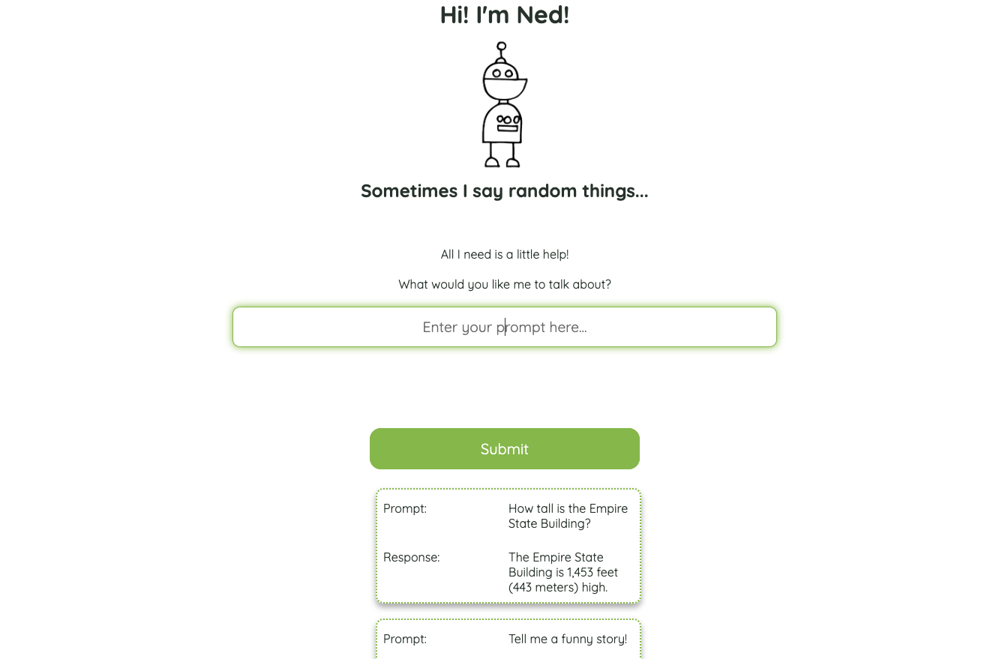

# NED Talks - Fun with GPT-3 - OpenAI

<a name="descsection"></a>
## Description
Meet Ned! A fun, loving, but also slightly awkward robot with a lot to say. The problem is that he is just a little shy and has a hard time initiating conversation. His lexicon is powered by the incredibly powerful OpenAI API. All you need to do to get him to speak is to ask him a question or make the first move. Bear in mind, the more descriptive your prompt, the more interesting his response is likely to be! 

NOTE: This application is having issues running when deployed due to a 401 error (unauthorized). After careful review and due diligence with regard to protecting the API key through the usage of environment variables, the issue persists. Everytime I would make a commit, while ensuring my .env file would not be pushed up to Github, I would still be notified by email that my API key was leaked and had triggered a rotation of the keys to get me a new protected one. I even went to the lengths of rebuilding a duplicate of the entire repository in another repo and also signing up for a second account with OpenAI through another email account, so as to completely separate from this instance. This resulted in a 429 error (too many requests), which I learned is an issue some other developers are running into with this API. At this point, I am convinced there is a potential issue with the API and I do not know how to proceed in order to get this project properly deployed.

[](https://opensource.org/licenses/MIT)


## Table of Contents
1. [ Description. ](#descsection)
2. [ Installation. ](#installsection)
3. [ License. ](#licensesection)
4. [ Contributing. ](#contribsection)
5. [ Questions. ](#questionssection)
6. [ Screenshots. ](#picsection)
7. [ Links. ](#linksection)
8. [ Resources/Credit. ](#creditsection)


<a name="installsection"></a>
## Installation
* There is no necessary installation process for this application. Just use it in on the web!

<a name="licensesection"></a>
## License
Copyright <2022>

Permission is hereby granted, free of charge, to any person obtaining a copy of this software and associated documentation files (the "Software"), to deal in the Software without restriction, including without limitation the rights to use, copy, modify, merge, publish, distribute, sublicense, and/or sell copies of the Software, and to permit persons to whom the Software is furnished to do so, subject to the following conditions:

The above copyright notice and this permission notice shall be included in all copies or substantial portions of the Software.

THE SOFTWARE IS PROVIDED "AS IS", WITHOUT WARRANTY OF ANY KIND, EXPRESS OR IMPLIED, INCLUDING BUT NOT LIMITED TO THE WARRANTIES OF MERCHANTABILITY, FITNESS FOR A PARTICULAR PURPOSE AND NONINFRINGEMENT. IN NO EVENT SHALL THE AUTHORS OR COPYRIGHT HOLDERS BE LIABLE FOR ANY CLAIM, DAMAGES OR OTHER LIABILITY, WHETHER IN AN ACTION OF CONTRACT, TORT OR OTHERWISE, ARISING FROM, OUT OF OR IN CONNECTION WITH THE SOFTWARE OR THE USE OR OTHER DEALINGS IN THE SOFTWARE.

  <a name="contribsection"></a>
## Contributing
  
1. [Fork the repo!](https://docs.github.com/en/get-started/quickstart/fork-a-repo)
2. Create a feature branch:
```
git checkout -b yourname-branch
```
3. Commit changes:
```
git commit -m 'Your changes here'
```
4. Push to the branch:
```
git push origin yourname-branch
```
5. Submit a pull request and wait for it to be approved or denied.


  <a name="questionssection"></a>
## Questions
* For any questions or clarification regarding OpenAI, please refer to their API documention.
* https://beta.openai.com/docs/introduction
  

  
  <a name="picsection"></a>
  ## Screenshots
  


  <a name="linksection"></a>
  ## Links

  Deployed Heroku Site: https://jonteal.github.io/fun-with-gpt-3/
  
  Github Site: https://github.com/jonteal/fun-with-gpt-3

  <a name="creditsection"></a>
## Resources/Credit
* https://beta.openai.com/docs/introduction
